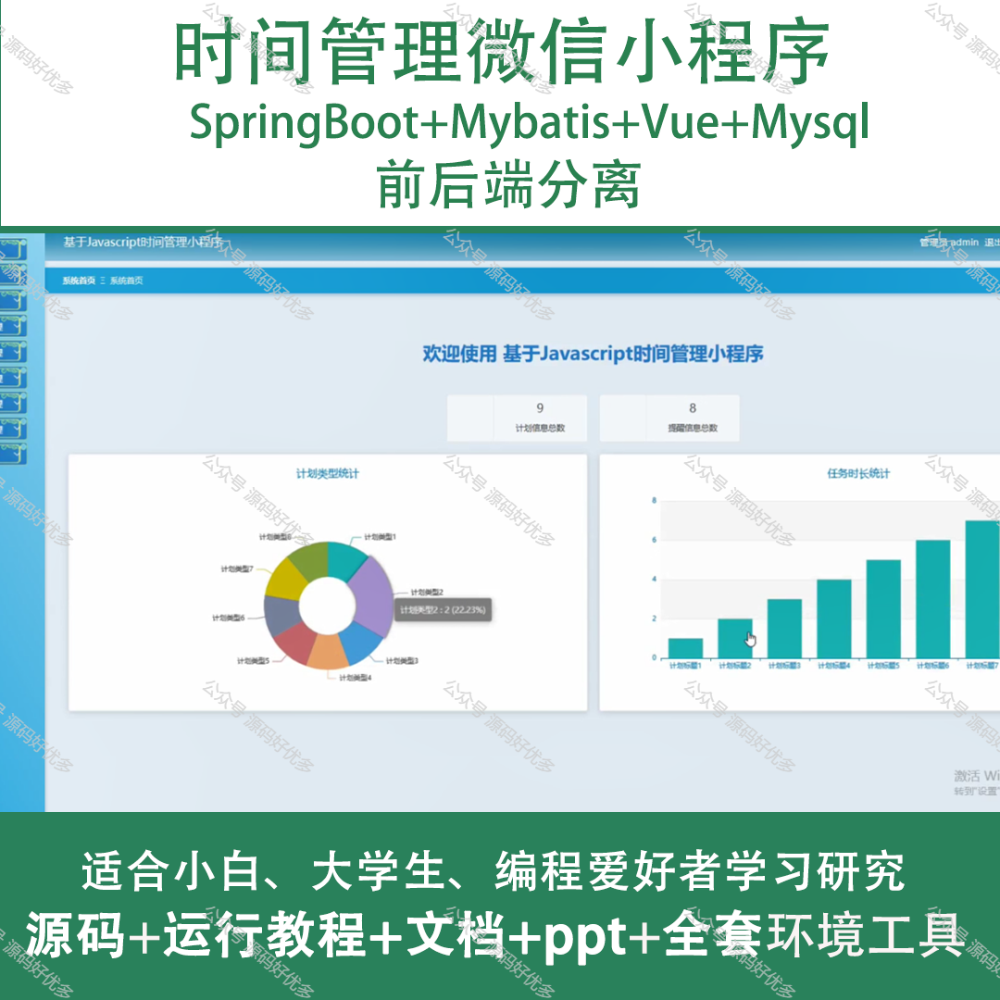
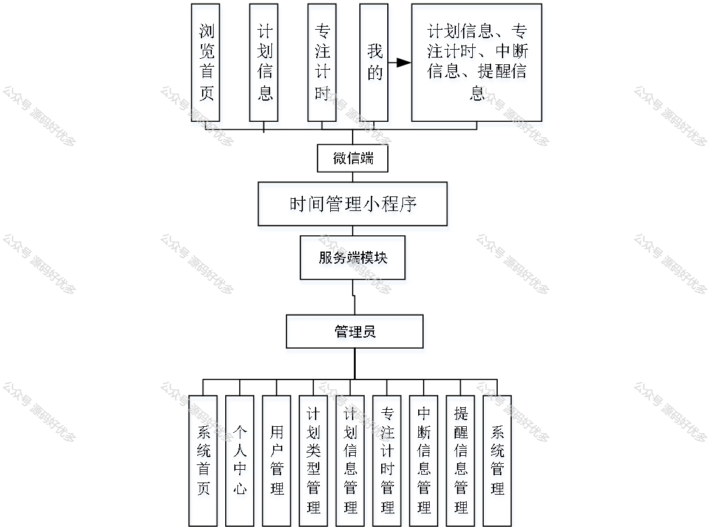
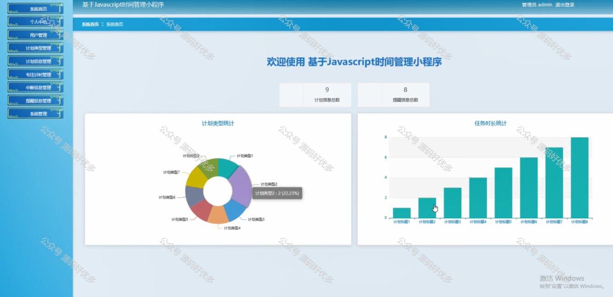
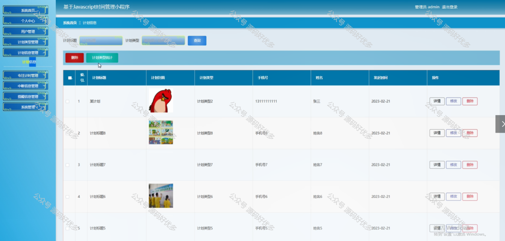
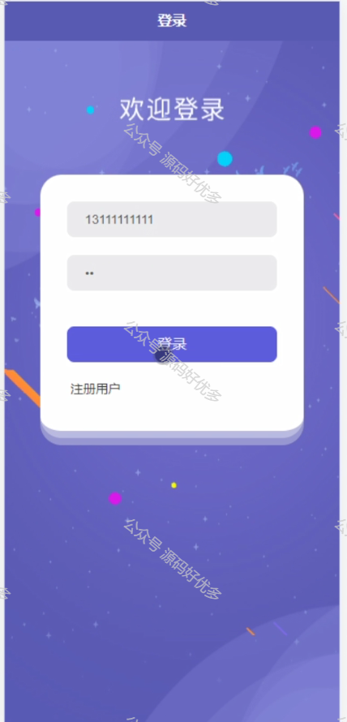
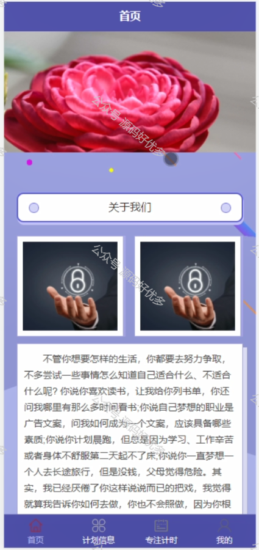
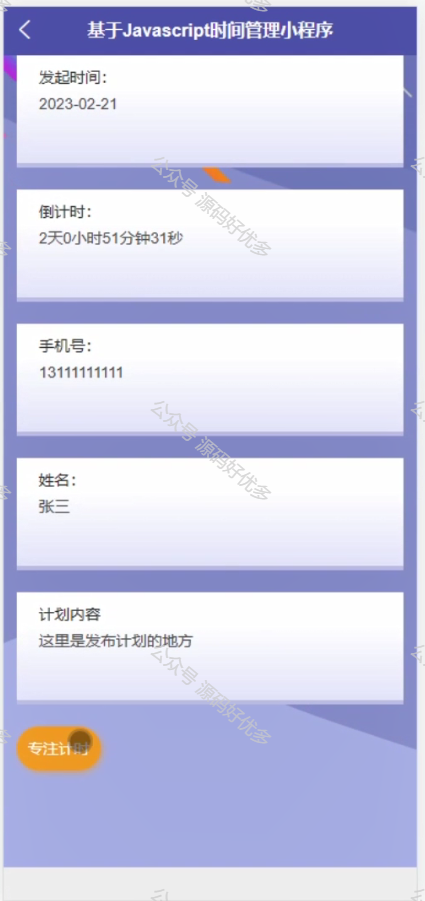
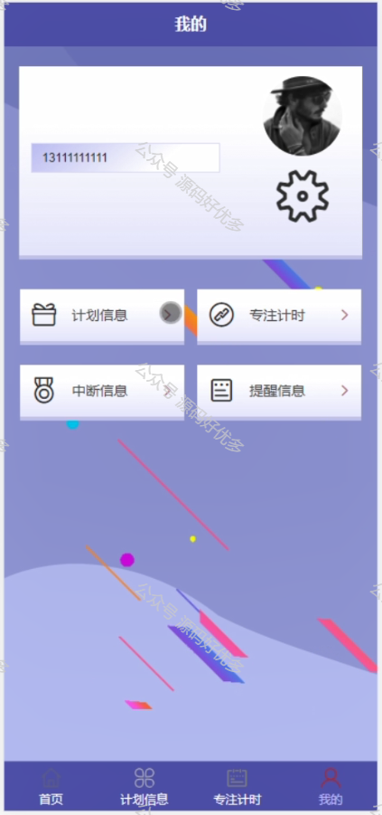
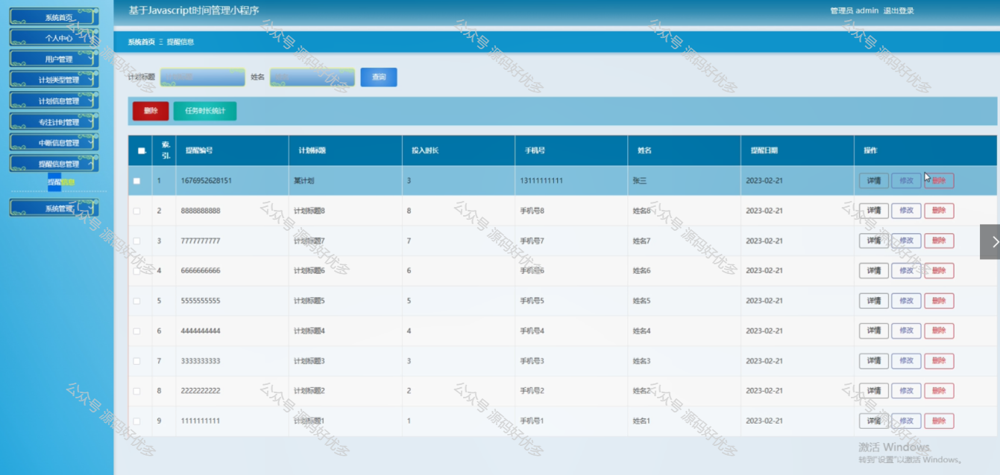

 
## 查看主页获取源码

> **作者介绍**： **✌**全网粉丝10W+本平台特邀作者、博客专家、CSDN新星计划导师、java领域优质创作者,博客之星、掘金/华为云/阿里云/InfoQ等平台优质作者、专注于项目实战 **✌**

  

### 一、作品包含

源码+数据库+设计文档万字+PPT+全套环境和工具资源+部署教程

### 二、项目技术

前端技术：Html、Css、Js、Vue、Element-ui

数据库：MySQL

后端技术：Java、Spring Boot、MyBatis

  

### 三、运行环境

开发工具：IDEA/eclipse + 微信开发者工具

数据库：MySQL5.7

数据库管理工具：Navicat10以上版本

环境配置软件： JDK1.8+Maven3.6.3

前端Nodejs：14

### 四、项目介绍
项目编号：mpweixinA048

时间管理微信小程序以现代社会快节奏生活和工作压力为背景，旨在帮助用户合理安排时间，提高效率，该小程序能够协助用户更好地平衡工作与生活，培养良好的时间管理习惯，从而实现个人目标和生活质量的提升。

前台用户功能：浏览首页、计划信息、专注计时、专注计时、中断信息、提醒信息。

后台管理员的功能：系统首页、个人中心、用户管理、计划类型管理、计划信息管理、专注计时管理、中断信息管理、提醒信息管理、系统管理。

### 五、运行截图

  

